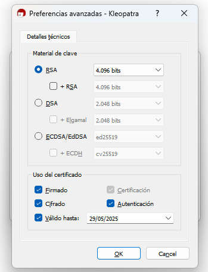
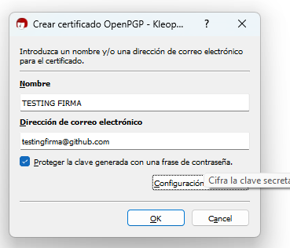
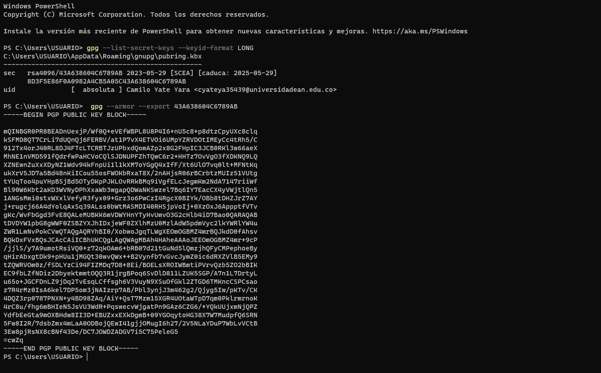
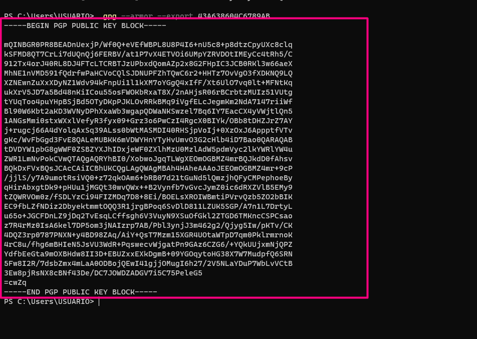
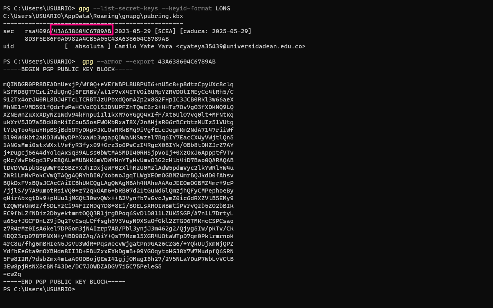
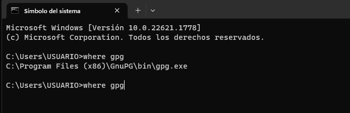

# verifiedCommits
Verified Commits on GPG Key

## PRIMEROS PASOS

1. Instalar GPG (https://www.gpg4win.org/)
2. Crear una clave GPG
3. 
4. 
5. Luego de presionar el bóton de generar, se debe ingresar una contraseña para la clave GPG
6. Ahora se ingresan los siguientes comandos en la terminal de git bash o PowerShell:
7. Comando para conocer la llave GPG: `gpg --list-secret-keys --keyid-format LONG`
8. 
9. Nota, en la imagen anterior se presenta un nombre y correo difirente, en ese caso se debe reemplazar por el nombre y correo que se utilizó en el paso 3.
10. Comando para exportar la llave GPG: `gpg --armor --export <ID de la llave GPG>`
11. 
12. Ahora ejecutamos los siguientes comandos git config `--global user.name "TESTING FIRMA"`, este nombre debe ser el mismo que se utilizó en el paso 3. Y debe hacer match con el repositorio de GitHub o Gitlab.
13. Ahora el correo `git config --global user.email "testingfirma@gitub.com"`
14. Luego poner el ID de la firma generada  git config `--global user.signingkey 43A638604C6789AB`
    
15. Ahora se debe configurar el commit para que sea firmado por defecto `git config --global commit.gpgsign true`
16. Ahora se debe configurar el siguiente parámetro `git config --global tag.gpgsign true`
17. Ahora se debe configurar el commit para que sea firmado por defecto `git config --global push.gpgsign true`
18. Ahora se debe configurar el commit para que sea firmado por defecto `git config --global merge.verifySignatures true`
19. Ahora se debe configurar la ruta de GPG `git config --global gpg.program "C:\Program Files (x86)\GnuPG\bin\gpg.exe"` Para conocer la ruta se debe ejecutar el siguiente comando `where gpg`
    
20. Finalmente la lleve GPG se debe agregar en GitHub o Gitlab, para ello se debe copiar el contenido del paso 10 y pegarlo en la configuración de la cuenta.
21. 

## Referencias: 
- https://docs.github.com/en/github/authenticating-to-github/managing-commit-signature-verification
- https://docs.github.com/en/github/authenticating-to-github/generating-a-new-gpg-key
- https://docs.github.com/en/github/authenticating-to-github/adding-a-new-gpg-key-to-your-github-account
- https://docs.gitlab.com/ee/user/project/repository/gpg_signed_commits/
- https://docs.gitlab.com/ee/user/project/repository/gpg_signed_commits/#adding-a-gpg-key-to-your-git-config

